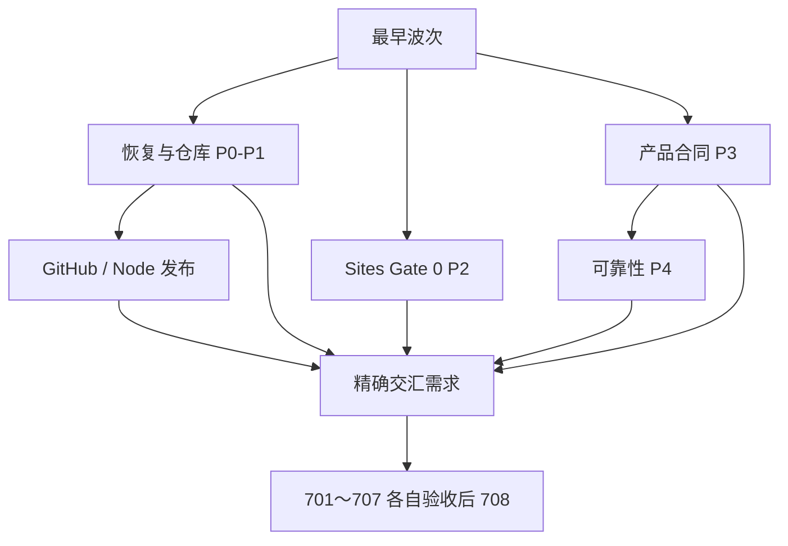

# v0.2 依赖图与并发波次

本图是计划约束，不是自动执行授权。边表示“前项证据满足后，后项才可开始”。同一波次只有在共同前置满足后才能并发。

## 1. 无环主图

## 2. 精确前置关系

- 恢复链：001→002→003→101；004 同时依赖 002、003、103、104。
- GitHub/云开发链：101→102；102→103、104；103 与 104→105。
- Sites Gate 0：201 无外部前置；201→202、203；202→204、205；204 与 205→206、207；206 与 207→208。
- 产品合同：301 无外部前置；301→302、303；302 与 303→304、305；304 与 305→306。
- 可靠性：302 与 304→405；405→401、402；402 与 405→403；401、402、403、405→404；302 与 304→406、407；401 与 407→408。
- 页面：501 依赖 301/302/303/306；502 依赖 302/306/406；503 依赖 302/306/401～408；504 依赖 306/401/407/408；505 依赖 306/403；506 依赖 202/305/306；507 依赖 303/304/306。
- Node 发布：102、103、104、105→601→602→603→604→605。
- Sites 发布：102、103、104、105 与 Gate 0 的 201～208→606。
- 验收：701 依赖 101～105；702 依赖 401～405/407；703 依赖 401/407/408/504/701；704 依赖 003/104/202/305/601；705 依赖 206/208；706 依赖 207/605/606；707 依赖 303/507/601/606；708 依赖 701～707。

## 3. 波次计划

| 波次 | 可并发工作 | 启动条件 | 出口证据 |
|---|---|---|---|
| W0 | A 线：001；B 线：201；C 线：301，三线同时启动 | 各自只需只读证据或设计授权；互不等待 | A 恢复来源；B 唯一 Workbench 项目入口；C 冻结两个顶层空间 |
| W1 | A：002→003→101；B：202/203；C：302/303 | 仅依赖各自上一节点 | 恢复/仓库回读；资源与浏览器身份；两空间核心对象 |
| W2 | A：102；B：204/205；C：304/305 | 各线真实前置满足 | 仓库治理；双层身份/迁移；状态 Gate/分类 |
| W3 | A：103/104；B：206/207；C：306、405/406/407 | 各线真实前置满足 | Cloud/CI；D1 导出恢复/Sites 回滚；页面结构与可靠性核心 |
| W4 | A：105 与 004；B：208；C：401/402/403，随后 404/408 | 004 另需 002/003/103/104；其余不跨线等待 | 协作规则/恢复完整性；启用前清场；投递、Outbox、重连、对账、无歧义 |
| W5 | 501～507、601、606、701、702、705 中前置已满足者可并发 | 每项严格使用第 2 节的精确依赖，不互相等待无关项 | 页面、云构建、Site 发布流程及可提前执行的专项验收 |
| W6 | 602；以及 703/704/707 中前置已满足者 | 601 或各自精确交汇前置完成 | 签名；审批、边界、追溯专项验收 |
| W7 | 603 | 602 满足 | Hermes 只镜像正式 GitHub Release |
| W8 | 604 | 603 满足 | 公司电脑只读升级 |
| W9 | 605 | 604 满足 | Node 双版本回滚 |
| W10 | 706 | 207、605、606 全部满足 | Sites/Node 双回滚验收 |
| W11 | 708 | 701～707 全部通过 | 文档、追溯和残余风险收口 |

## 4. 无环校验规则

恢复/GitHub、Sites Gate 0、产品合同三线从最早波次独立推进。第 2 节的逐项依赖是唯一权威；任何不可展开到具体 WB 编号的集合依赖都禁止出现。需求只能依赖本线更早节点或真实跨线交汇点；不得让 GitHub/Codex 基础设施成为 Sites 现状回读或产品合同设计的伪前置。新增边必须先做拓扑校验。人为等待和省略真实前置都属于“假并发”。
