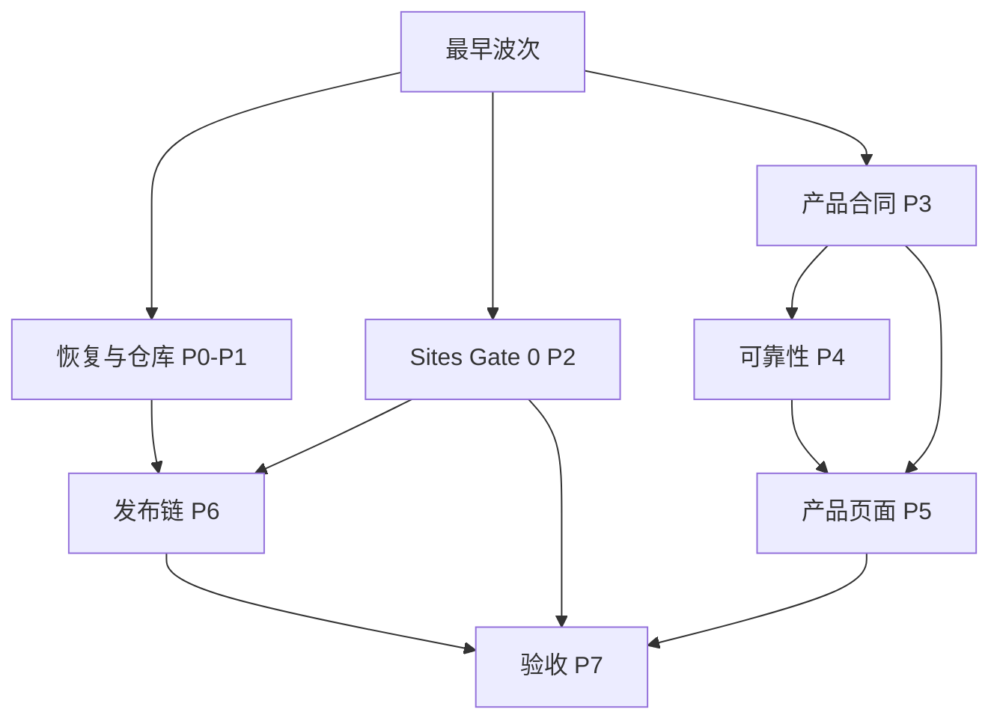

# v0.2 依赖图与并发波次

本图是计划约束，不是自动执行授权。边表示“前项证据满足后，后项才可开始”。同一波次只有在共同前置满足后才能并发。

## 1. 无环主图

## 2. 精确前置关系

- 恢复链：001→002→003→101；004 同时依赖 002、003、103、104。
- GitHub/云开发链：101→102；102→103、104；103 与 104→105。
- Sites Gate 0：201 无外部前置；201→202、203；202→204、205；204 与 205→206、207；206 与 207→208。
- 产品合同：301 无外部前置；301→302、303；302 与 303→304、305；304 与 305→306。
- 可靠性：302 与 304→405；405→401、402；402 与 405→403；401、402、403、405→404；302 与 304→406、407；401 与 407→408。
- 页面：产品合同 301～306 与可靠性 401～408 全部满足后，501～507 可并发。
- Node 发布：102、103、104、105→601→602→603→604→605。
- Sites 发布：102、103、104、105 与 Gate 0 的 201～208→606。
- 验收：实现项 301～306、401～408、501～507、601～606 全部完成后，701～707 可按隔离场景并发；701～707 全部通过后→708。

## 3. 波次计划

| 波次 | 可并发工作 | 启动条件 | 出口证据 |
|---|---|---|---|
| W0 | A 线：001；B 线：201；C 线：301，三线同时启动 | 各自只需只读证据或设计授权；互不等待 | A 恢复来源；B 唯一 Workbench 项目入口；C API 版本合同 |
| W1 | A：002→003→101；B：202/203；C：302/303 | 仅依赖各自上一节点 | 恢复/仓库回读；资源与浏览器身份；两空间核心对象 |
| W2 | A：102；B：204/205；C：304/305 | 各线真实前置满足 | 仓库治理；双层身份/迁移；状态 Gate/分类 |
| W3 | A：103/104；B：206/207；C：306、405/406/407 | 各线真实前置满足 | Cloud/CI；空白/应用回滚；业务 API 与可靠性核心 |
| W4 | A：105 与 004；B：208；C：401/402/403，随后 404/408 | 004 另需 002/003/103/104；其余不跨线等待 | 协作规则/恢复完整性；D1 恢复；投递、Outbox、重连、对账、无歧义 |
| W5 | C：501～507；A 发布线：601；A+B 交汇：606 | 页面只等产品合同与可靠性；601 只等 GitHub/CI；606 才合流 GitHub/CI 与 Sites Gate 0 | 页面；云构建；唯一 Site 人工发布流程 |
| W6 | 602→603→604→605 | Node 发布链每一步只在前一步证据满足后串行 | 签名、正式 Release 镜像、只读升级、双版本回滚 |
| W7 | 701～707 | 所有实现项完成，三条线在最终验收合流 | 七类独立验收证据 |
| W8 | 708 | 701～707 全部通过 | 文档、追溯和残余风险收口 |

## 4. 无环校验规则

恢复/GitHub、Sites Gate 0、产品合同三线从最早波次独立推进。需求只能依赖本线更早节点，或真实的跨线交汇点；不得让 GitHub/Codex 基础设施成为 Sites 现状回读或产品合同设计的伪前置，也不得让实现需求反向成为合同、Gate 0 或仓库治理的前置。新增边必须先做拓扑校验。人为等待和省略真实前置都属于“假并发”。
