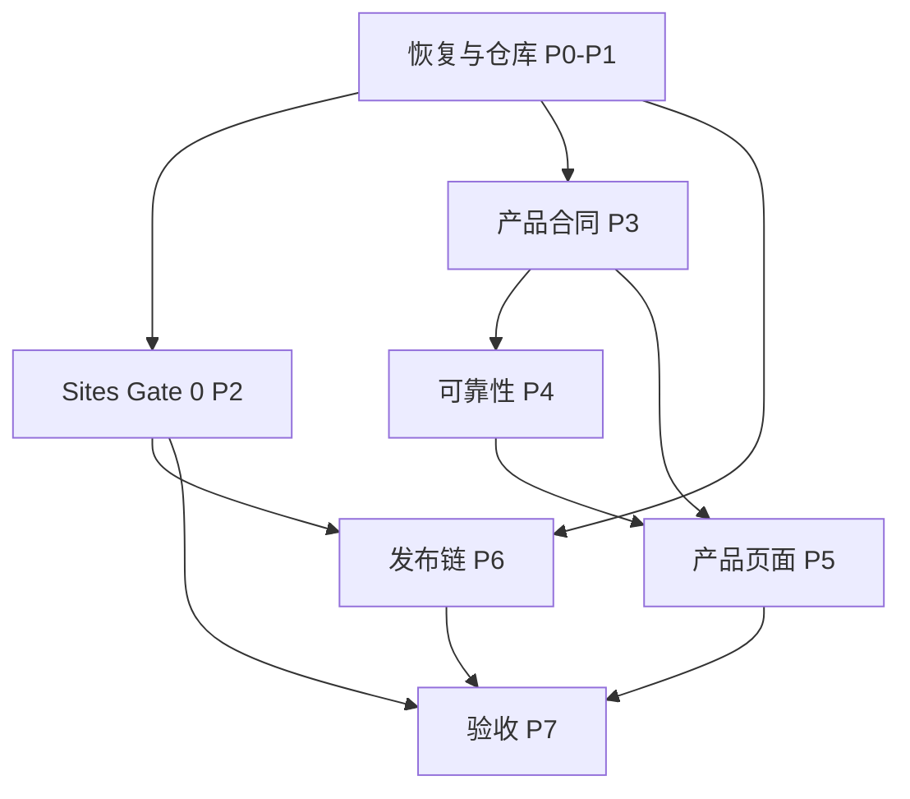

# v0.2 依赖图与并发波次

本图是计划约束，不是自动执行授权。边表示“前项证据满足后，后项才可开始”。同一波次只有在共同前置满足后才能并发。

## 1. 无环主图

## 2. 精确前置关系

- 恢复链：001→002→003→101；004 同时依赖 002、003、103、104。
- GitHub/云开发链：101→102；102→103、104；103 与 104→105。
- Sites Gate 0：201→202、203；202→204、205；204 与 205→206、207；206 与 207→208。
- 产品合同：301→302、303；302 与 303→304、305；304 与 305→306。
- 可靠性：302 与 304→405；405→401、402；402 与 405→403；401、402、403、405→404；302 与 304→406、407；401 与 407→408。
- 页面：产品合同 301～306 与可靠性 401～408 全部满足后，501～507 可并发。
- Node 发布：102、103、104、105→601→602→603→604→605。
- Sites 发布：102、103、104、105 与 Gate 0 的 201～208→606。
- 验收：实现项 301～306、401～408、501～507、601～606 全部完成后，701～707 可按隔离场景并发；701～707 全部通过后→708。

## 3. 波次计划

| 波次 | 可并发工作 | 启动条件 | 出口证据 |
|---|---|---|---|
| W0 | 001→002→003；随后 101 | 只读恢复证据可用 | 恢复包、边界、Private/main/commit/tag 回读 |
| W1 | 102；完成后 103 与 104 并发 | 101 满足 | 仓库治理、Cloud 环境、CI 直接证据 |
| W2 | 105；004 | 103 与 104 满足，004 另需 002/003 | 协作规则；恢复完整性验收 |
| W3 | 201 与 301 可并发 | W2 的基础设施满足且用户授权 | Sites 项目入口；API 版本合同 |
| W4 | 202/203；302/303 | 各自主前置满足 | 资源/浏览器身份；两个空间核心对象 |
| W5 | 204/205；304/305 | W4 对应前置满足 | 双层身份、迁移；状态/Gate、分类 |
| W6 | 206/207；306；405/406/407 | W5 对应前置满足 | 空白/应用回滚；业务 API；可靠性核心 |
| W7 | 208；401/402/403；随后 404/408 | W6 对应前置满足 | 恢复演练；投递、Outbox、重连、对账、无歧义 |
| W8 | 501～507；601 起点；606 | 产品合同与可靠性完成；发布链另满足 GitHub/CI 和 Gate 0 | 页面；云构建；Sites 发布流程 |
| W9 | 602→603→604→605 | 每一步只在前一步证据满足后串行 | 签名、Release、只读升级、双版本回滚 |
| W10 | 701～707 | 所有实现项完成 | 七类独立验收证据 |
| W11 | 708 | 701～707 全部通过 | 文档、追溯和残余风险收口 |

## 4. 无环校验规则

需求只能依赖更早波次，或同波次中明确写出的串行前项；不得让实现需求反向成为其合同、Gate 0 或仓库治理的前置。新增边必须先做拓扑校验。为制造并发而省略真实前置，视为“假并发”并拒绝进入计划。

